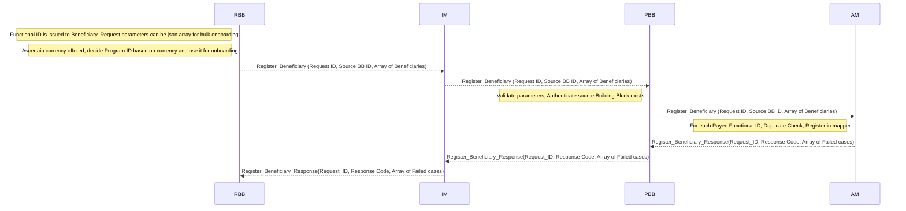
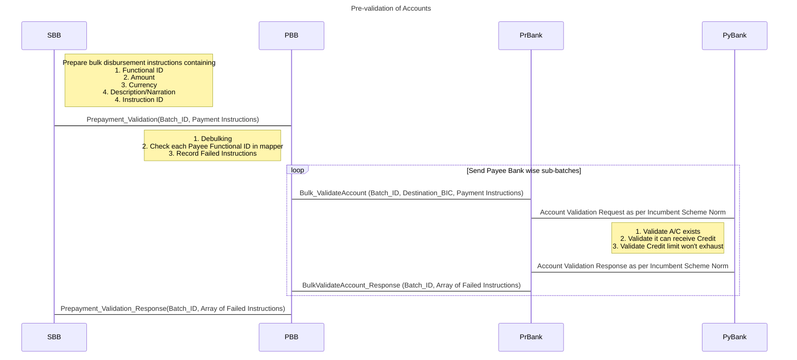
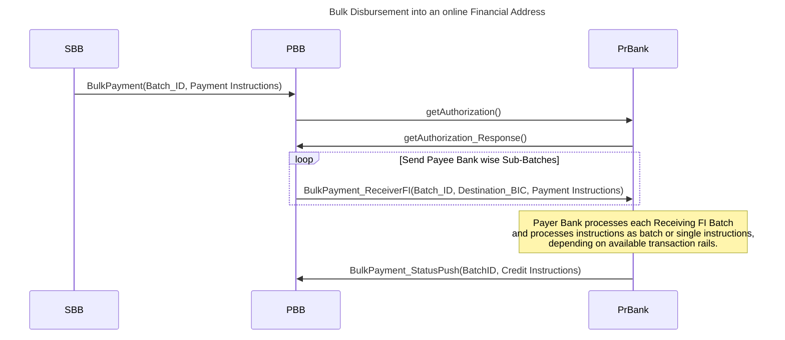

# 9.1 G2P Bulk Payment

This section discusses the various processes involved in G2P disbursement, such as beneficiary onboarding into the Account Mapper, bulk disbursements to pre-registered financial addresses, and account pre-validation prior to bulk disbursement. This section includes considerations for a Multiple Independent Currency model.

### 9.1.1 Beneficiary onboarding in Account Mapper

The workflow represents the process of onboarding beneficiaries in the ID Mapper as a prerequisite step before any payment processing can occur. This use case is triggered when a new G2P beneficiary has been onboarded by a G2P program, assigned a Functional ID, and verified as eligible for the social benefit program.

In the Multicurrency case the G2P program which is associated with a payment account in a currency must match the currency of the account the individual receives the payment in. Therefore Steps 1-3 in the below workflow are indicative of steps needed in the **Registration Building Block** to ensure this

1. _(Step needed for Multiple Independent Currencies Approach)_ The requesting Building Block, ascertains the currency of the beneficiary from those offered by the government.
2. _(Step needed for Multiple Independent Currencies Approach)_ The requesting Building Block decides the correct program ID based on the offered currency and the currency to be paid to the beneficiary (they must match)
3. _(Step needed for Multiple Independent Currencies Approach)_ The requesting Building Block uses this program ID as the basis for following steps 4-11.
4. The requesting Building Block (RBB) sends a "Register\_Beneficiary" request to the Information Mediator (IM), containing the Request ID, Source Building Block (SBB) ID, and an array of beneficiaries with their Functional ID, Payment Modality, and Financial Address (if available).
5. IM forwards the "Register\_Beneficiary" request to the Payments Building Block (PBB) with the same parameters.
6. PBB validates the API parameters and checks if the Source Building Block is configured in the Payments BB as an acceptable source of the API call.
7. If the parameters are valid, PBB sends the "Register\_Beneficiary" request to the Account Mapper (AM) with the same parameters.
8. Account Mapper checks for duplicate Functional IDs registered by the same Source Building Block and registers the beneficiaries in the mapper if they are not already registered.
9. Account Mapper sends a "Register\_Beneficiary\_Response" to PBB, which contains the Request ID, response code, and an array of failed cases (if any) with descriptions.
10. PBB forwards the "Register\_Beneficiary\_Response" to IM, with the same parameters.
11. Finally, IM sends the "Register\_Beneficiary\_Response" to RBB, providing the final response code and the list of any failed cases with descriptions.

The workflow supports the addition of beneficiaries in the mapper in bulk. The source building block can use the same APIs for individual or bulk onboarding.

### 9.1.2 Pre-validation of accounts prior to bulk disbursement

This flow represents the pre-validation process of accounts in a bulk disbursement scenario. The process involves a Source BB (SBB), the Payments BB (PBB), a Payer Bank (PrBank), and Payee Bank (PyBank). To support multicurrency use cases, the currency parameter must be passed.

1. The process begins with the Source BB (SBB) preparing bulk disbursement instructions containing key information such as the Functional ID, amount, currency (for multicurrency), narration, and instruction ID.
2. SBB sends these instructions as a pre-payment validation request (Prepayment\_Validation) to Payments BB (PBB).
3. Upon receiving the request, PBB performs several actions, including debulking the instructions, checking each payee's Functional ID in the mapper, and recording any failed instructions.
4. PBB then sends payee bank-wise sub-batches for validation in a loop. For each sub-batch, PBB sends a bulk validate account request (Bulk\_ValidateAccount) to the Payer Bank (PrBank), including the batch ID, destination BIC, and payment instructions.
5. PrBank forwards the account validation request to the Payee Bank (PyBank) as per the incumbent scheme norm.
6. PyBank performs several validation checks, such as confirming the account exists, verifying that it can receive credit, and ensuring that the credit limit won't be exhausted.
7. PyBank sends an account validation response back to PrBank, adhering to the incumbent scheme norm.
8. PrBank then sends a bulk validate account response (BulkValidateAccount\_Response) to PBB, containing the batch ID and an array of any failed instructions.
9. Finally, PBB sends a prepayment validation response (Prepayment\_Validation\_Response) to SBB, including the batch ID and an array of any failed instructions.

This flow ensures that the accounts involved in a bulk disbursement transaction are valid and capable of receiving the specified credits before processing payments, reducing the risk of failed transactions and improving overall efficiency.

### **9.1.3** Bulk Disbursement into a Financial Address pre-registered in the Account Mapper

The workflow depicted below illustrates the process of bulk disbursement into financial addresses, such as bank accounts or mobile wallets, that are pre-registered in the [Account Mapper](../3-terminology.md#account-mapper-or-account-lookup-directory-service). This use case is triggered when the Source BB submits a batch for processing of payments to the Payments BB.

Pre-conditions: Functional IDs intended to be recipients of funds must be pre-registered in the Account Mapper. All the financial addresses must be validated before a payment is disbursed.

Data Inputs: Source BB provides relevant confirmation to the Payments BB to begin credit transfer for successfully pre-validated accounts.

1. The process starts with Source Building Block (SBB) sending a BulkPayment request containing a Batch\_ID and a set of payment instructions to the Payment Building Block (PBB).
2. PBB checks if liquidity was provisioned before this batch is executed and if sufficient liquidity was provisioned. If this is the case, PBB proceeds to de-bulk crediting batches by the receiving institution.
3. PBB then requests authorization from the PrBank by sending a getAuthorization() message.
4. PrBank responds with a getAuthorization\_Response() message, granting the required authorization to PBB.
5. PBB begins sending payee bank-wise sub-batches to PrBank in a loop. For each sub-batch, PBB sends a BulkPayment\_ReceiverFI message containing the Batch\_ID, Destination\_BIC, and payment instructions.
6. The Payer Bank (PrBank) executes these batches through existing rails.

Exceptions: Some accounts might have been pre-validated or part of the crediting batch but cannot be credited by the payee bank for some reason. For such accounts, funds must be returned to the payer bank and credited back into the Source BB's Settlement Account through a separate process.

In order to facilitate the transfer of funds from the disbursement organisation (the payer) to the mobile money provider, the mobile money provider would need to be connected to the payment gateway/switch. Should this connection not be in place, the disbursement could be facilitated by a third-party aggregator or there would need to be a bilateral connection between the payer’s Financial Service Provider and the Mobile Money Provider.
