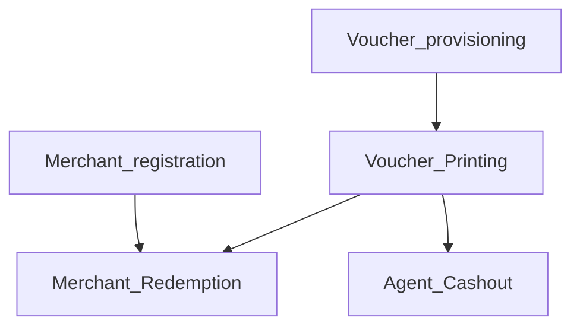
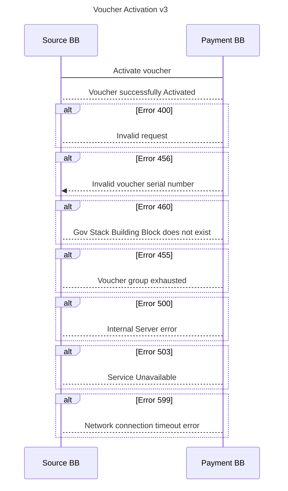
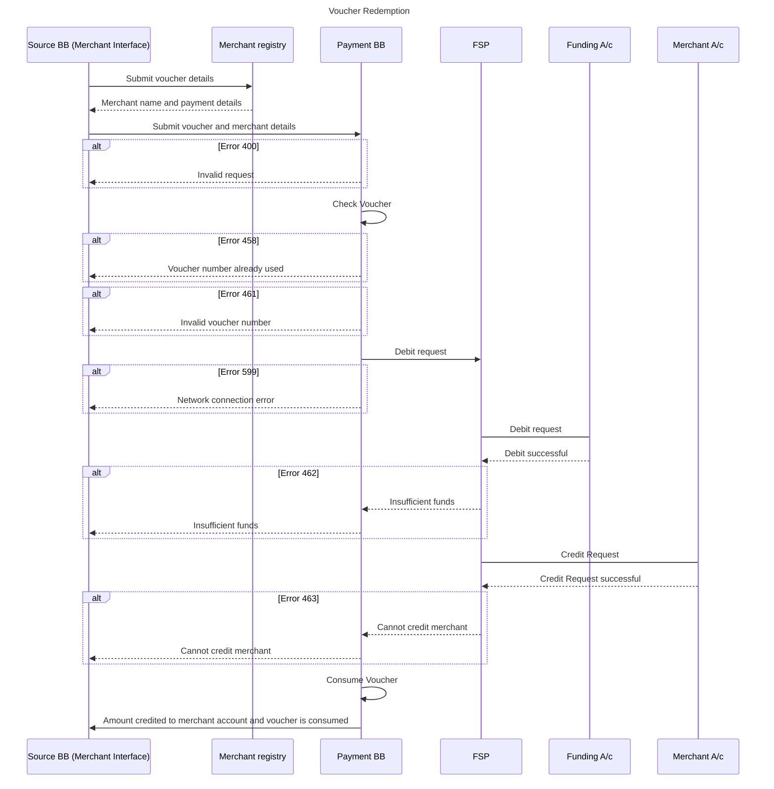
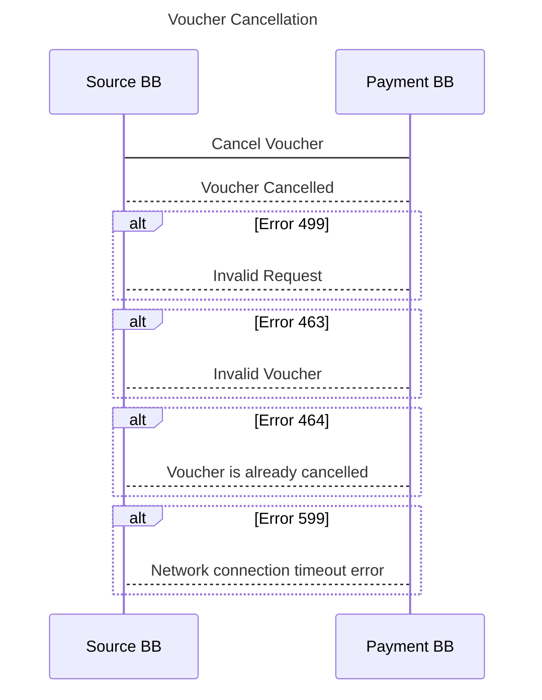

# 9.2 Voucher Payments

The Voucher Management System supports three workflows for voucher payments:

1. administration (voucher provisioning and merchant registration),
2. voucher issuing (pre-activation and activation),
3. redemption use cases as shown in the diagram below.

These use cases and the relationship between each one of them are shown and further described below.

The use cases are described in the diagram below:

### **9.2.1 Voucher administration**

These processes are usually done prior to the issuance of the voucher to ensure a smooth flow at the point of issuance.

The Admin processes for the Voucher Management Server cover the lifecycle of the vouchers and are typically performed by a privileged user (this may be done through User Interface or an API). These processes include but are not limited to creating voucher groups, provisioning vouchers, suspending vouchers, unsuspending vouchers, validating vouchers, key management, and purging of used vouchers.

* Voucher Provisioning\
  This function will be done by an administrator (privileged user). It will typically be triggered by the deposit of funds in a funding account, thus the source account. Voucher provisioning creates a conditional right to funds and an inventory of issued vouchers. Other processes related to this are voucher inventory management, voucher suspension, and voucher purging.
* Merchant Registration\
  In order for efficient redemption of vouchers merchants MUST be registered in advance to create a network of trusted providers. This registration is assumed to be managed by the Registration Building Block, The account verification of the merchant can be done at registration or during redemption subject to a configuration.\
  \
  During the registration process, merchants MAY also be assigned to different voucher groups depending on the required function that has been implemented. For example, there may be a voucher group for schools. This implies that vouchers of this type can only be redeemed at schools. This also requires that the user flow system at which the voucher is issued is aware of these voucher groups and is able to send the appropriate request to the Voucher Management System.
* Agent Registration\
  In markets where cashouts are being used, it is expected that the Registration Building Block will register agents in a similar way.
* Voucher Groups\
  Depending on the requirement it should also be possible to set up multiple voucher groups. Vouchers in the same voucher group will have similar characteristics and are labeled with a specific voucher group name. During voucher provisioning, a voucher can be created and attached to a single voucher group. When a voucher is requested (using the pre-activation API) it is expected that the voucher group will be one of the parameters set.
* Voucher Issuing\
  Voucher issuing is triggered by the Registration Building Block which will determine whether the conditions of issuance have been met. The calling Block will determine the denomination and voucher group of the voucher to be issued. The voucher number and the voucher serial number that is issued can be presented to the beneficiary in multiple ways including but not restricted to encoding in the form of QR codes, bar codes, printed vouchers, or even SMS. This is outside the scope of the Payments Building Block. It is expected that Building Blocks through which the voucher is redeemed will also be able to decode the voucher.

### **9.2.2 Voucher Activation workflow**

The voucher activation flow is shown in the diagram below.

Flow Description:

* An external Building Block may invoke the Payments Building Block API gateway to pre-activate API on the Voucher Management Server with the amount of the voucher, the voucher currency, and the voucher group. The calling Building Block may optionally send a comment. The comment will be stored by the voucher server. The voucher group will indicate that it is looking for a voucher from a specific voucher group. This API call will be made through the Payments orchestrator.
* The voucher group is typically used for conditional social transfer (e.g. for school fee payment). If any voucher can be used for any purpose, then all vouchers should be created with a generic voucher group (e.g. “GENERAL-PURPOSE”).
* The API returns to get a voucher number, the voucher serial number, and its expiry date. At this point, the voucher will be flagged as Pre-Activated.
* The calling Building Block may render the voucher as a QR code, as a barcode, or even as an SMS text. It is recommended that the voucher should include supplementary data of the recipient. It is also recommended that this data should also be printed in human-readable form so that the recipient can verify the data on the voucher. This data can also be verified at the point of redemption.
* Once the calling API successfully prints/issues the QR code, the voucher can then be activated using the activation API. It is assumed that there will not be a substantial delay between pre-activation and activation to necessitate the need for multiple expiry periods.

Alternative: the voucher could be activated immediately on being requested. This could be controlled at the Payments Orchestrator.

* Preconditions
  * The calling registration block will determine that all the necessary preconditions are met.
  * The most critical precondition is the prefunding which will be done manually at the voucher provisioning stage. Other options that could be prefunding triggered by activation or at redemption are not considered because they are considerably more complex and create additional failure points in the activation of the vouchers.
* Assumptions/Queries
  * It is assumed that only one currency will be used.
  * A zero-trust architecture.
  * The transaction is not reversible.
* Post-Condition\
  The calling Building Block may invoke another payment Building Block API, e.g. initiating an incentive payment for the agent.

### **9.2.3 Voucher Redemption workflow**

The voucher redemption process is shown in the diagram below.

Flow Description:

* At redemption, the beneficiary shows the voucher to the merchant or agent.
* The merchant/agent will scan and interpret the medium in which the voucher is presented (this could be a QR code or a barcode or an SMS or even a printed number).
* Voucher redemption Validation: The details presented MAY allow the merchant/agent to authenticate/validate the owner of the voucher.
* The agent will then initiate the redemption process which will call the Payment Building Block API Management Gateway.
* The API Management Gateway will validate the voucher and initiate the payment through the payment gateway.
* If specific voucher groups have been set up, voucher usage may be restricted to specific merchants. An override parameter should also be provided that will allow a Voucher of any voucher group to be redeemed at any merchant.
* Once the payment to the merchant/agent is successful the Payment gateway will inform the API Management Gateway.
* The API Management Gateway will then instruct the VMS API to flag the voucher as consumed.

Alternatives:

* Payments could be made through a switch in which case there would be no need for prefunding accounts in each financial institution.

Preconditions:

* The merchant must have been registered possibly by the Registration Building Block with their preferred payment method.
* The merchant must have a mechanism (e.g. a mobile APP, USSD app, or SMS option) to verify the beneficiary prior to redemption.

Assumptions:

* The app for reading the QR code and redemption is not part of the scope of the Payment Building Block.
* The entire voucher amount is consumed. Partial redemption will not be allowed.
* The amount that is paid to the merchant or agent is debited from a prefunded account.

**Sample Redemption**

.png>)

Note:

In the case of a physical voucher, the voucher number or the secret number is hidden behind some material that must be scratched away to see the number. The voucher number is also commonly known as the PIN.

### **9.2.4 Voucher Cancellation workflow**

The voucher cancellation flow is shown in the diagram below.

Flow Description:

* The calling Building Block will request the API Management Gateway to cancel a Voucher.
* The API Management Gateway will invoke the VMS API to cancel the Voucher.
* The Vaucher Management System (VMS) API interface will check if the Voucher is valid and then cancel the Voucher.
* The VMS API interface will confirm that the Voucher has been canceled.

Alternatives:

* If the Voucher does not exist, the VMS API will respond that the Voucher does not exist.
* If the Voucher is already consumed, the VMS API will respond that the Voucher is already consumed.
* If the Voucher is already canceled the VMS API will respond that the Voucher is already canceled.
* If the Voucher is suspended the VMS API will respond that the Voucher is suspended.
* All calls from external parties (e.g. Registration Building Block) to the voucher management system will be initiated through the API management gateway.
* The payment orchestration module may direct transitions between the various functions.
* The discovery service could be called by other building blocks to determine where bank accounts/wallets sit.
* The only function that speaks to the DFS is the payment gateway. Any function that needs to speak to the DFS goes through the Payment gateway.
* The Payment gateway may need to speak to a Number Portability provider.
* Audit trails (transaction logs) capture each event as it happens and are to be used for queries, analysis, and reconciliation.
* Event logs will capture specific events that happen at each node.
