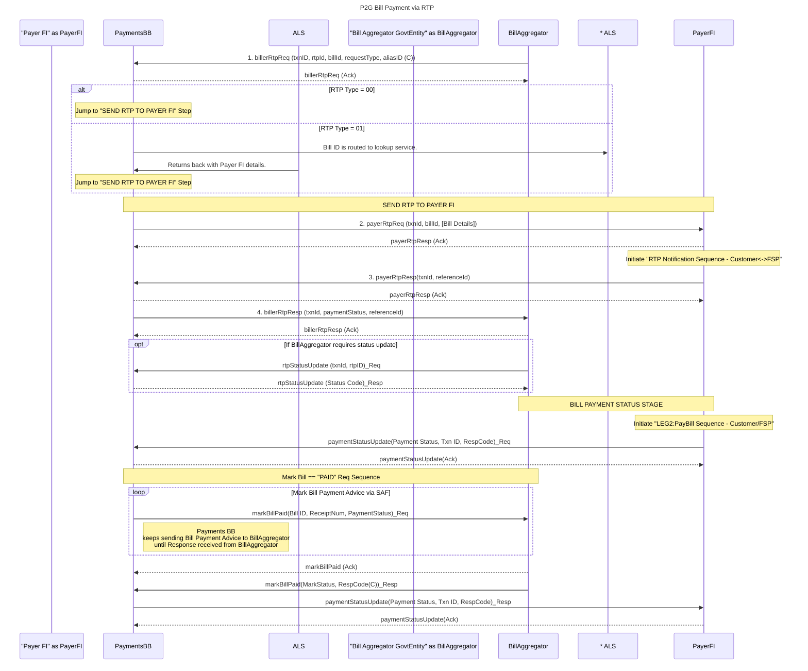
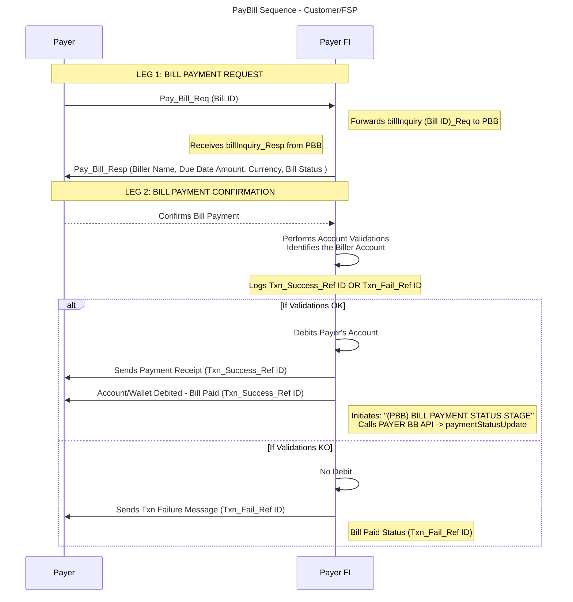
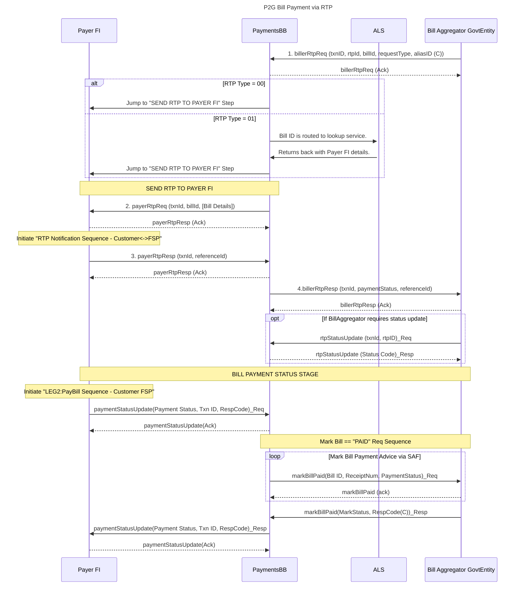
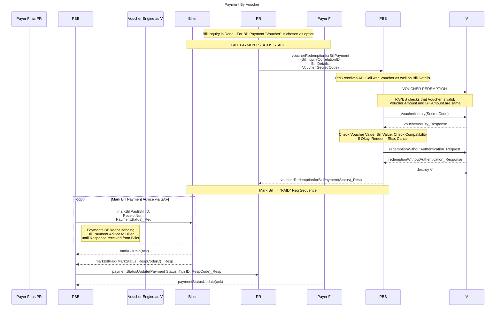

# 9.3 P2G Bill Payments

The following types of P2G payments are considered.

* Bill payments such as utilities
* Payments for government services (for example application for a birth certificate)

The following is assumed for bill payment with the Payments BB

* The Bill ID generation or distribution scenario of a jurisdiction is already decided and in place.
* Depending upon the applicable scenario all relevant billers, aggregators or bill payment systems responsible for distributing the Bill IDs to consumers, are also registered with the Payments BB.
* The Settlement of bill amounts is carried out by the relevant payers and payee FSPs.
* The Payments BB will generate a report or allow a data extract that would contain the log of transactions that would be used for settlement of the transactions between the Payer FSP and the Billers or Aggregators FSPs

In order to support multicurrency payments, currency is an important consideration to ensure that bills are paid in the currency raised, as such currency would need to be indicated on bills and payments as indicated in the diagram in section 9.3.3.&#x20;

The following processes are involved in government bill payments:

### **9.3.1 Biller onboarding**

The biller onboarding would be a one–time prerequisite activity required to be carried out before consumers could pay bills to them.

The main function of Payment BB in this case is allocating unique IDs to the registering entity and ensuring that all Bill Payment related queries are routed to these registered entities.

The relationship between billers and aggregators and how they identify specific bills from the consumers numbers is their responsibility, and is out-of-scope for Payments BB.

<figure><figcaption>
Biller/Aggregator Onboarding
</figcaption></figure>

#### Pre-conditions:

* The structure of the unique ID is defined including, the length of the unique ID and whether the ID is simply a sequential number or if each digit of the ID identifies any unique entity/actions.

The incoming biller/ aggregator has the required infra to support continuous requests and updates.

#### Flow description:

* Onboarding Request: This step could be a manual process where a representative gathers all the required information from the billers and aggregators and enters it into the system via a UI-based form/ table. (This process may go through the make checker process)
* Unique IDs and Prefixes are generated by the system for each direct biller or aggregator (depending upon the billing ecosystem model). The entire information is saved in the system in the ‘Billers Table’.
* The billers and aggregators are returned a unique ID and prefix allocated to them.
* The billers and aggregators concatenate the unique ID and prefix before the Bill IDs that they generate and share with their consumers.

### **9.3.2 Payer Financial Institution – PBB Linking for Bill Payments**

The Payer FI – PBB linking is a one–time prerequisite activity required before consumers can request bill payment over the Payments BB. Setting up of the front end, UI to take the requests from the consumers would fall under the responsibility of the Payer FI only and would be out of the scope of payments BB

#### Pre-conditions:

* The Payer FSP is enabled for Interbank Funds Transfer (for settlement) – Out of Scope of PBB
* The Payer FSP is equipped with the right infrastructure to communicate with the PBB

#### Flow description:

Payer FSP – PBB Linking would be an offline process comprising formal agreements and the following activities to ensure proper functioning:

* PBB shares the list of Billers and the unique IDs allotted to them with the Payer FSP
* PBB shares its endpoints and required API contracts that need to be setup at the FSP;
* PBB shares the _required_ Bank and Account Details of each registered Biller with the FSP for carrying out financial transactions and settlement activities. The biller details could be either manually configured by the Payer FSP at their end or Payments BB could prepare a file and keep it at a central location for Payer FSP to download/ upload it (as decided).

#### Post-conditions:

Once the Payer FSP is setup with PBB for Bill Payment Services then it is expected that it:

* Would be able to accept from its customers Bill IDs of different Billers.
* Would be able to differentiate at its end the exact biller/ aggregator for which the customer has entered the Bill ID.
* Would be able to credit the respective account of the biller based on the account information shared by PBB at the time of linking.
* Would duly notify the PBB of the final status of the Bill Payment Request (successful debit/ Failed debit)

### **9**.3.3 Bill Inquiry & Bill Payment Update via Payment BB

After the completion of the prerequisite setups, the Payment BB is ready to accept requests from the Payer FSPs and retrieve information from and communicate with the Billers, Aggregators, and Government Entities.

#### Main responsibilities of Payment BB in the flow:

1. The PBB would receive the Bill Inquiry as a result of Pay Bill request at a Payer FI – Payer end.
2. PBB would validate the sender of request and send it on to the respective Biller or Govt. Entity to fetch bill.
3. The Payer FSP would then either perform payment confirmation or abort the transaction – in either case it would notify the PBB of the Payment Status
4. Receiving the Payment Status Update the PBB would forward the Payment confirmation to Biller or Govt. Entity
5. PBB sends Mark Bill Paid Advice to the Biller or Govt Entity until a response is received from that site.
6. Upon receiving a response from the Biller or Aggregator, the PBB would notify the Payer FSP of the response.
7. The Government Agency sends an invoice to the payer, detailing the amount owed.
8. The Government Agency also sends a copy of the invoice to the designated Bill Aggregator.
9. The Bill Aggregator then sends the invoice reference number to the Payments Building Block .
10. The payer, upon receiving the invoice, provides the invoice reference number to their preferred Collection Financial Service Provider (Collection Financial Services Provider).
11. The Collection Financial Services Provider (FSP) requests transaction details, including the amount to be paid, currency (for multicurrency) from the Payments Building Block using the invoice reference number.
12. The Payments Building Block, in turn, requests the transaction details from the Bill Aggregator.
13. The Bill Aggregator provides the requested transaction details to the Payments Building Block.
14. The Payments Building Block forwards the transaction details to the Collection FSP.
15. The Collection FSP executes the payment based on the transaction details provided.
16. After completing the payment, the Collection FSP sends the payment reference to the Payments Building Block.
17. The Payments Building Block forwards the payment reference to the Bill Aggregator.
18. Finally, the Bill Aggregator sends the payment reference to the Government Agency, confirming the completion of the payment.

#### 1. Bill inquiry stage

* **Payer FI** initiates the process by querying bill details.
* **Payer FI** requests bill inquiry using `billInq(Txn ID, Bill ID)_Req`.
* **PaymentsBB** validates the request, performing security checks and registration status verification.
  * If validations fail, **PaymentsBB** sends an error response to **Payer FI**.
  * If validations succeed, **PaymentsBB** identifies the biller and moves to the next step.

#### 2. Biller discovery

* **PaymentsBB** identifies the biller by querying the **Billers Table** using `IdentifyBiller(Prefix)`.
* **Billers Table** provides **PaymentsBB** with the Biller's endpoint information.
* **PaymentsBB** then proceeds to fetch the bill from the **Bill Aggregator/Government Entity**.

#### 3. Fetch Bill

* **PaymentsBB** requests bill details from **Bill Aggregator or Government Entity** using `billInqBiller(Bill ID)`.
* **Bill Aggregator or Government Entity** performs internal checks (e.g., payment status, expiry) and responds with bill details.
* **PaymentsBB** forwards bill details to **Payer FI** for review.

#### 4. Bill Payment Status

* **Payer FI** reviews the bill details and initiates the payment sequence.
* **Payer FI** updates the payment status using `paymentStatusUpdate(Payment Status, Txn ID, RespCode)`.
* **PaymentsBB** acknowledges the update and marks the bill as "PAID" in the request sequence.
* **PaymentsBB** sends payment advice to **Bill Aggregator or Government Entity** until a response is received.
* Once confirmed, **Bill Aggregator or Government Entity** acknowledges the payment and updates the status.
* Finally, **PaymentsBB** notifies **Payer FI** of the successful payment update

### 9.3.4 Payer FI – Customer Bill Payment Flow 

### 9.3.5 P2G bill payment via request to pay flow

### 9.3.6 P2G bill payment with voucher

