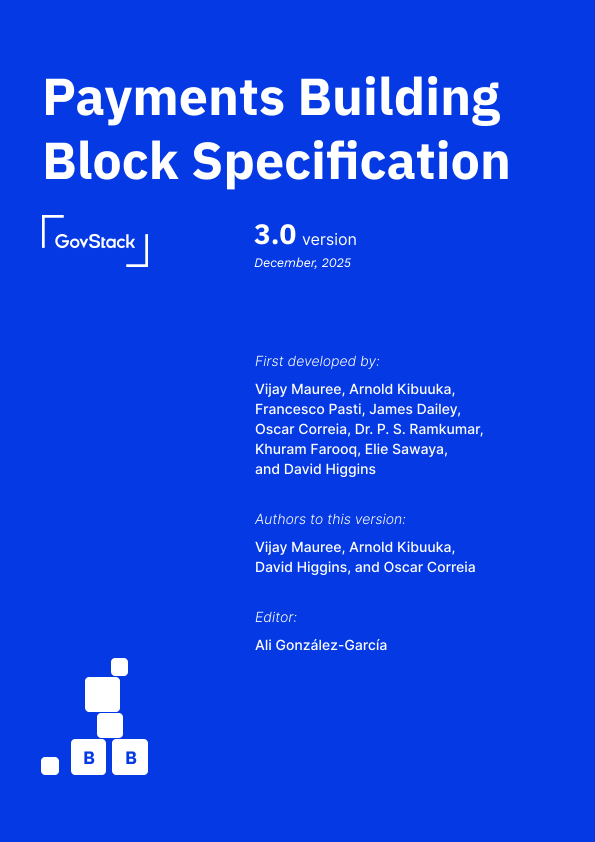

# Payments Building Block Specification

_**First Developed by:**_\
Vijay Mauree, Arnold Kibuuka, and Dr. P. S. Ramkumar ([ITU](https://itu.int)), Francesco Pasti ([GSMA](https://www.gsma.com/)), James Dailey, David Higgins ([MIFOS](https://mifos.org)), Oscar Correia ([Maarifa Education](https://www.maarifaeducation.com/)), Khuram Farooq ([World Bank](https://www.worldbank.org/)) and Elie Sawaya ([GIZ](https://giz.de/))

***

_**Authors to this version:**_\
Vijay Mauree, Arnold Kibuuka, David Higgins, and Oscar Correia

_**Editor:**_\
Ali González-García

<figure><figcaption>
Payments Building Block cover
</figcaption></figure>
